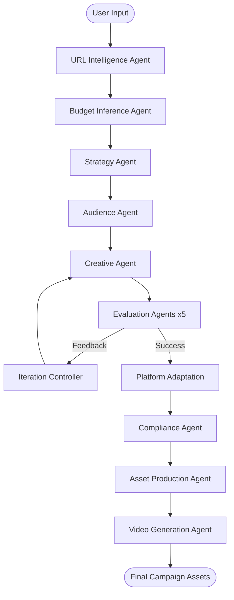

<p align="center">
  <h1 align="center">ads-ai</h1>
  <p align="center">Multi-Agent Advertising Intelligence Pipeline for end-to-end campaign generation.</p>
  <p align="center">
    <a href="#installation"></a>
    <a href="LICENSE"></a>
    <a href="https://github.com/sachncs/ads-ai/actions"></a>
    <a href="https://pypi.org/project/ads-ai/"></a>
    <a href="https://github.com/sachncs/ads-ai/stargazers"></a>
  </p>
</p>

**ads-ai** is a production-grade, multi-agent AI framework for end-to-end
advertising campaign generation. The system extracts intelligence from
product URLs, synthesizes strategic briefs, generates creative variants,
evaluates them against quantifiable quality thresholds, and produces
video assets ready for deployment.

---

## Features

- **13-Step Automated Pipeline** — Programmatic evaluation gates ensure every ad variant meets brand, clarity, and intent thresholds before proceeding to production
- **19 Specialized Agents** — Domain-expert agents for strategy, audience modeling, creative generation, compliance validation, and asset production
- **Veo 3.1 Video Synthesis** — Direct integration with Google's Veo 3.1 model for generating high-fidelity video advertisements from structured scripts
- **Quantified Quality Enforcement** — Built-in [Quality Standards](docs/QUALITY_STANDARDS.md) that gate creative production based on measurable, AI-evaluated metrics
- **Dynamic Pipeline Stages** — `PipelineStageRegistry` with declarative configurations, dependency resolution, topological sorting, and configurable retry policies
- **CLI + Python API** — Use the `ads-ai` CLI or import the SDK directly
- **Validated Outputs** — All inter-stage payloads are Pydantic v2 models
- **Multi-Provider LLM** — Pluggable provider abstraction; swap Gemini for any other model with one configuration change

---

## Installation

### From PyPI

```bash
pip install ads-ai
```

### From source

```bash
git clone https://github.com/sachncs/ads-ai.git
cd ads-ai
pip install -e .
```

### With dev dependencies

```bash
pip install -e ".[dev,test,lint]"
```

**Prerequisites:** Python 3.10 or higher, Google AI Studio API key
([Get one here](https://aistudio.google.com/apikey)).

---

## Quick Start

### CLI

```bash
# URL mode — extracts product context automatically
ads-ai --url "https://example.com/product" --goal "Maximize Sales"

# Explicit mode — provide product and audience directly
ads-ai --product "Ergonomic Chair" --audience "Remote Workers" --goal "Drive Conversions"

# JSON output for downstream tooling
ads-ai --url "https://example.com/product" --goal "Brand Awareness" --output json
```

### Configuration

```bash
cp .env.example .env
# Edit .env and set GEMINI_API_KEY
```

### Python API

```python
from ads_ai import Pipeline, URLIntelligenceAgent, StrategyAgent

# Build a pipeline programmatically
pipeline = Pipeline()
pipeline.add_stage(URLIntelligenceAgent())
pipeline.add_stage(StrategyAgent())

result = await pipeline.run(
    url="https://example.com/product",
    goal="Drive Conversions",
)

print(result.strategy_brief)
```

For detailed setup instructions, see
[docs/getting-started.md](docs/getting-started.md).

---

## Configuration

| Setting | Env Variable | Default | Description |
|---------|--------------|---------|-------------|
| Gemini API key | `GEMINI_API_KEY` | *(required)* | Google AI Studio API key |
| Model | `ADS_AI_MODEL` | `gemini-3.1-pro` | LLM model identifier |
| Veo model | `ADS_AI_VEO_MODEL` | `veo-3.1` | Video generation model |
| Log level | `ADS_AI_LOG_LEVEL` | `INFO` | Logging verbosity |
| Max retries | `ADS_AI_MAX_RETRIES` | `3` | Retry count per stage |
| Artifact dir | `ADS_AI_ARTIFACT_DIR` | `./artifacts` | Output directory for campaign assets |

See [`.env.example`](.env.example) for the full template.

---

## Architecture



| Stage | Agent | Purpose |
|-------|-------|---------|
| 0 | URLIntelligenceAgent | Extract product context from a URL |
| 0.5 | BudgetInferenceAgent | Auto-infer budget when not provided |
| 1 | StrategyAgent | Generate strategy brief with KPIs |
| 2 | AudienceAgent | Model behavioral personas |
| 3 | CreativeAgent | Generate 3-5 ad script variants |
| 4 | Evaluation Agents (x5) | Parallel quality evaluation |
| 5 | ScoringAgent | Composite GO/NO-GO scoring |
| 6 | IterationControllerAgent | Refinement directives for failing variants |
| 7 | PlatformAdaptationAgent | Platform-specific adaptation |
| 8 | ComplianceRiskAgent | Legal and brand safety compliance |
| 9 | AssetProductionAgent | Shot-by-shot production planning |
| 10 | ExternalValidationAgent | A/B test design |
| 11 | DeploymentExperimentationAgent | Launch timeline and scaling |
| 12 | KnowledgeLearningAgent | Pattern capture from campaigns |
| 13 | VideoGenerationAgent | Veo 3.1 video synthesis |

See [docs/ARCHITECTURE.md](docs/ARCHITECTURE.md) for the full architecture
deep-dive.

### Agent Workforce

| Agent | Responsibility | Output |
|:------|:---------------|:-------|
| **StrategyAgent** | Strategic pillars, KPIs, and pre-release targets | `StrategyBrief` |
| **AudienceAgent** | Behavioral persona modeling and intent simulation | `AudienceSegments` |
| **CreativeAgent** | Narrative structure, hooks, and visual cue design | `CreativeVariants` |
| **ScoringAgent** | Multi-dimensional readiness gating (GO/NO-GO) | `CompositeReadinessReport` |
| **VideoGenAgent** | Cinematic prompt synthesis and Veo rendering | `VideoGenerationResult` |
| *...and 14 more* | See [Agents Overview](ads_ai/agents/README.md) | |

---

## Examples

### Run a campaign from a URL

```bash
ads-ai --url "https://acme.com/ergo-chair" --goal "Maximize ROAS" --output json > campaign.json
```

### Explicit product + audience

```bash
ads-ai --product "Standing Desk Mat" --audience "WFH Engineers" --goal "Drive Conversions"
```

### Programmatic pipeline

```python
import asyncio
from ads_ai import Pipeline

async def main():
    pipeline = Pipeline.from_config("ads_ai.yaml")
    result = await pipeline.run(
        product="Ergonomic Chair",
        audience="Remote Workers",
        goal="Drive Conversions",
    )
    print(result.creative_variants)

asyncio.run(main())
```

---

## Project Structure

```
ads-ai/
├── ads_ai/                    # Main package
│   ├── __init__.py            # Version and public API
│   ├── config.py              # Settings from environment variables
│   ├── main.py                # CLI entry point
│   ├── pipeline.py            # OrchestratorPipeline
│   ├── pipeline_stages.py     # Dynamic stage registry
│   ├── agents/                # 19 specialized agents
│   │   ├── base.py            # BaseAgent with LLM interface
│   │   ├── models.py          # 40+ Pydantic models
│   │   ├── strategy.py        # Strategy generation
│   │   ├── creative.py        # Ad script generation
│   │   ├── video.py           # Veo 3.1 integration
│   │   └── ...                # Additional agents
│   └── utils/                 # Shared utilities
│       ├── file_ops.py        # Artifact management
│       ├── prompts.py         # Prompt templates
│       └── timing.py          # Performance instrumentation
├── tests/                     # Test suite (126+ tests)
├── docs/                      # Documentation
│   ├── ARCHITECTURE.md        # System design
│   ├── QUALITY_STANDARDS.md   # Agent quality expectations
│   ├── getting-started.md     # Setup guide
│   └── faq.md                 # Common questions
├── .github/                   # GitHub configuration
│   ├── workflows/ci.yml       # CI pipeline
│   ├── dependabot.yml         # Dependency updates
│   ├── ISSUE_TEMPLATE/        # Issue templates
│   └── PULL_REQUEST_TEMPLATE.md
├── pyproject.toml             # Project metadata and dependencies
├── .env.example               # Environment variable template
└── LICENSE                    # MIT License
```

---

## Development

```bash
pip install -e ".[dev,test,lint]"
pytest tests/ -v --cov=ads_ai
ruff check ads_ai/ tests/
ruff format ads_ai/ tests/
mypy ads_ai/ --ignore-missing-imports
```

### Running Tests

```bash
pytest tests/ -v --cov=ads_ai --cov-report=term-missing
python3 tests/standalone_runner.py   # No API key required
```

---

## Testing

```bash
pytest tests/ -v
pytest tests/ -v --cov=ads_ai --cov-report=term-missing
```

---

## Build

```bash
python -m build
```

---

## Release

1. Bump version in `pyproject.toml`
2. Update `CHANGELOG.md` with the new release notes
3. Commit with a `version:X.Y.Z` message
4. Tag the commit and push — GitHub Actions publishes to PyPI

---

## Tech Stack

| Category | Technology |
|----------|------------|
| Language | Python 3.10+ |
| LLM Framework | Google GenAI (Gemini 3.1 Pro / Flash Lite) |
| Video Generation | Google Veo 3.1 |
| Data Validation | Pydantic v2 |
| Settings | pydantic-settings |
| Build System | Hatchling |
| Linting | Ruff |
| Type Checking | mypy |
| Testing | pytest + pytest-cov |

---

## Roadmap

- [ ] Add support for additional video generation providers
- [ ] Implement campaign performance analytics dashboard
- [ ] Add multi-language support for ad generation
- [ ] Create web UI for non-technical users
- [ ] Add support for image ad generation
- [ ] Implement A/B test result analysis agent
- [ ] Add cost estimation and budget optimization
- [ ] Support batch campaign generation

---

## Contributing

We welcome contributions! See [CONTRIBUTING.md](CONTRIBUTING.md) for:

- Fork and branch workflow
- Commit conventions ([Conventional Commits](https://www.conventionalcommits.org/))
- Pull request process
- Coding standards and quality requirements

## Code of Conduct

This project follows the [Contributor Covenant v2.1](CODE_OF_CONDUCT.md).
Please read it before participating.

## Security

For reporting vulnerabilities, see [SECURITY.md](SECURITY.md).

## License

[MIT](LICENSE) © 2026 Sachin